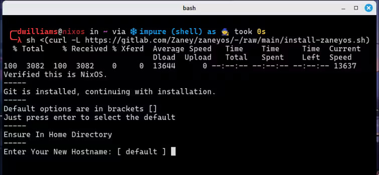
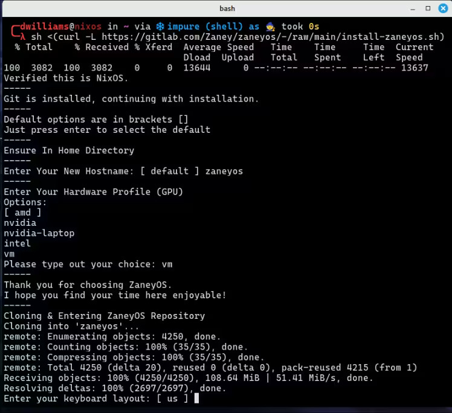
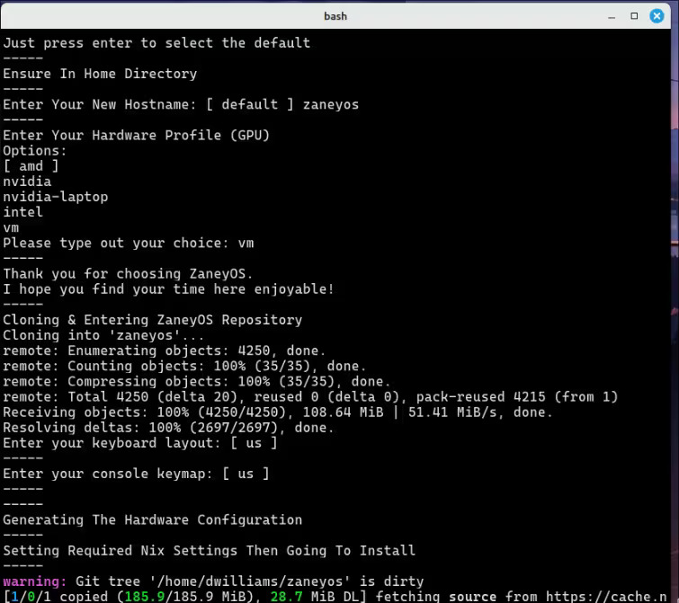
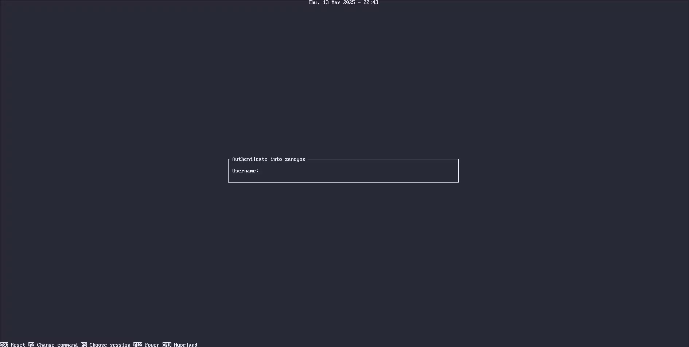

[English](README.md) | [Español](README.es.md) | [हिन्दी](README.hi.md) | [भोजपुरी (बिहारी)](README.bh.md) | [ಕನ್ನಡ](README.kn.md) | [தமிழ்](README.ta.md) | [తెలుగు](README.te.md) | [संस्कृतम्](README.sa.md) | [Deutsch](README.de.md) | [日本語](README.ja.md) | [Русский](README.ru.md) | [বাংলা](README.bn.md) | [Français](README.fr.md) | [Português](README.pt.md) | [العربية (الكويت)](README.ar.md) | [繁體中文 (台灣)](README.zh_TW.md) | [Italiano (Svizzera)](README.it.md)
n**Nota: Por favor, perdone cualquier error lingüístico en esta traducción; la he proporcionado en su idioma para que pueda entender mejor la documentación y el proyecto. Para precisión técnica, por favor consulte las versiones en inglés.**

**Nota: Por favor, disculpe cualquier error lingüístico en esta traducción; la he proporcionado en su idioma para que pueda entender mejor la documentación y el proyecto. Para mayor precisión técnica, consulte las versiones en inglés o español.**

<div align="center">

## MayankOS 🟰 Mejores Configs ❄️ NixOS

\*\* Actualizado: 22 de abril de 2026

MayankOS es una forma potente y elegante de reproducir mi configuración de NixOS en cualquier sistema. Construido con la flexibilidad e inspiración del proyecto **ZaneyOS**, proporciona un entorno altamente personalizado que incluye fondos de pantalla, scripts, aplicaciones y un soporte de hardware optimizado.

## 🚀 Nuevas características y soporte de hardware (v2.6.1)

Esta versión trae optimizaciones significativas y soporte para hardware moderno:

### 💻 MSI Modern 14 C7M y serie AMD 7000
- **Rendimiento optimizado para AMD 7530U**: Utiliza plenamente `amd-pstate-epp` y `auto-cpufreq` para un equilibrio perfecto entre potencia y duración de batería.
- **Gestión de salud de la batería**: Soporte nativo para **umbrales de batería MSI** a través de `msi-ec`, protegiendo tu batería al limitar la carga al 80% cuando está enchufado.
- **Escalado de energía avanzado**: Cambio automático entre los modos `performance` (rendimiento) y `powersave` (ahorro de energía) según el estado de la alimentación.
- **Gráficos de nueva generación**: Soporte completo de `amdgpu` con aceleración por hardware VA-API, ROCm y herramientas Vulkan preconfiguradas.

### 🎨 Experiencias de Shell diversas
Elige tu experiencia de escritorio preferida configurando `barChoice` en `variables.nix`:
- **Noctalia**: Un shell moderno y rico en funciones con controles de sistema integrados.
- **Caelestia**: Una alternativa elegante y ligera.
- **DMS (DankMaterialShell)**: Un shell inspirado en Material Design para un aspecto elegante y moderno.
- **Waybar**: La clásica barra de estado altamente personalizable.

### 🔧 Mejoras del sistema
- **Último Kernel de Linux**: Ahora funcionando en la línea del **kernel 7.x** para la mejor compatibilidad de hardware.
- **Soporte mejorado para Niri**: Integración completa para el compositor de mosaico desplazable Niri.
- **Virtualización mejorada**: Soporte optimizado para VMware y otras plataformas de virtualización.

## 🤝 Relación con ZaneyOS

MayankOS es un orgulloso descendiente del legendario proyecto [ZaneyOS](https://gitlab.com/Zaney/zaneyos.git). Si bien comparte el mismo espíritu de hacer que NixOS sea accesible y hermoso, MayankOS ha evolucionado hacia una distribución distinta con su propio enfoque:

### 🌟 ¿Qué hace que MayankOS sea diferente?
- **Enfoque en Hardware Moderno**: A diferencia del enfoque más general de ZaneyOS, MayankOS incluye optimizaciones profundas para la última **serie AMD Ryzen 7000** y **portátiles MSI** (incluyendo la gestión de la salud de la batería).
- **Ecosistema de Shell Ampliado**: Hemos ido más allá de Waybar para incluir soporte completo para **Noctalia**, **Caelestia** y **DMS**, brindándole más opciones para su flujo de trabajo de escritorio.
- **Estrategia del Último Kernel**: Priorizamos `linuxPackages_latest` (7.x+) para garantizar que las funciones de hardware más nuevas funcionen de inmediato.
- **Opciones de Compositor Expandidas**: Hemos integrado soporte completo para el **compositor de mosaico desplazable Niri**, proporcionando una alternativa moderna a Hyprland para los usuarios que prefieren un flujo de trabajo de mosaico desplazable.
- **Internacionalización Mejorada**: Soporte para más de 13 idiomas para llevar la experiencia NixOS a una audiencia global.

Si está buscando la inspiración original, visite el [GitLab Oficial de ZaneyOS](https://gitlab.com/Zaney/zaneyos.git). MayankOS toma esa base increíble y la lleva más allá para los usuarios que necesitan soporte de hardware de vanguardia y una gama más diversa de shells de escritorio.

## 🏗️ Instalación: Automática vs. Manual

MayankOS ofrece dos formas principales de comenzar:
1. **Script automático (recomendado para nuevos usuarios)**: Una instalación rápida de un solo comando que se encarga de todo por ti. Esta es la forma más rápida de obtener un escritorio funcional.
2. **Instalación manual**: Para usuarios que desean un control total sobre cada aspecto de su sistema. La instalación manual es mejor si deseas personalizar tus herramientas *antes* de tu primera reconstrucción.

## ⚡ Estación de trabajo profesional de ingeniería de hardware y VLSI

MayankOS está diseñado específicamente para ser una estación de trabajo profesional de alto rendimiento para **VLSI e ingeniería de hardware**.

- **Por qué es perfecto**: Viene preconfigurado con una suite completa de herramientas para:
  - **Simulación HDL**: `ghdl`, `nvc`, `iverilog`, `verilator`, `gtkwave`, `surfer`, `fusesoc`, `surelog`.
  - **Síntesis y diseño físico**: `yosys`, `magic-vlsi`, `netgen`, `klayout`, `openroad`, `xschem`, `gdsfactory`. (Listo para OpenLane)
  - **Desarrollo de FPGA y embebidos**: `nextpnr`, `icestorm`, `openfpgaloader`, `dfu-util`, `qemu`.
  - **LSPs y Herramientas**: `sv-lang`, `vhdl-ls`, `verible`, `veridian`, `svls`, `pyverilog`, `verilogae`, `volare`.
  - **PDKs**: Soporte completo para **SkyWater 130** y **GF180MCU** a través de `volare`.
  - **Diseño de PCB y esquemas**: `kicad`, `ngspice`, `xyce`, `doxygen`.
- **Cómo personalizar**: Si NO necesitas estas herramientas, simplemente puedes comentar o eliminar el bloque `# --- VLSI & Hardware Engineering ---` en `modules/core/packages.nix` antes de ejecutar tu `nixos-rebuild`.
- **EDA Avanzado**: Para herramientas como **OpenLane** o suites de DFT avanzadas que aún no están en Nixpkgs estándar, recomendamos usar el overlay [nix-eda](https://github.com/nix-eda/nix-eda) o contenedores Docker para garantizar la compatibilidad con PDK.
- **Listo para el futuro**: Esto es solo el comienzo; se planean más herramientas especializadas de VLSI y EDA (incluyendo soporte integrado para OpenLane v2) para futuras actualizaciones para hacer de MayankOS la plataforma definitiva para los diseñadores de hardware.

## 🌐 Elección y personalización del navegador web

### ¿Por qué Microsoft Edge?

Por defecto, MayankOS ahora utiliza **Microsoft Edge**. Reconocemos que la comunidad de Linux tiene fuertes preferencias por navegadores como Firefox, Zen o Brave. Sin embargo, Edge fue seleccionado para esta estación de trabajo porque:
- **Compatibilidad**: Ofrece una excelente estabilidad con portales de documentación de hardware profesional y herramientas EDA basadas en la web.
- **Rendimiento**: Proporciona un manejo eficiente de PDF y gestión de memoria para investigaciones técnicas intensivas.
- **Flujo de trabajo**: Se alinea con las necesidades de ingeniería específicas de esta estación de trabajo VLSI.

### Cómo cambiar su navegador predeterminado

Si prefiere un navegador diferente, MayankOS facilita el cambio:
1. **Cambie la variable**: Abra el archivo `variables.nix` de su host (por ejemplo, `hosts/msi-modern14c7m/variables.nix`) y cambie la línea `browser` por su elección (por ejemplo, `browser = "firefox";`).
2. **Verifique la instalación**: Asegúrese de que su navegador preferido esté en la lista de `modules/core/packages.nix`. Si no está allí, simplemente agregue el nombre de su paquete (por ejemplo, `librewolf`) a la lista.
3. **Reconstruir**: Ejecute `mcli rebuild` o su comando de reconstrucción específico (por ejemplo, `sudo nixos-rebuild switch --flake .#amd`) para aplicar el cambio.

¡Creemos en la elección y la libertad. MayankOS está diseñado para ser su estación de trabajo personal; ¡siéntase libre de hacerla suya!

## 🛠️ Guía de Configuración de Hardware Personalizado y Host

1. **Creación de un Nuevo Host**:
   - Copie la carpeta `hosts/default` a una nueva carpeta con el nombre de su computadora (por ejemplo, `cp -r hosts/default hosts/mi-portatil`).
2. **Generación de su Configuración de Hardware**:
   - Ejecute `nixos-generate-config --show-hardware-config > hosts/su-hostname/hardware.nix` para detectar automáticamente su hardware específico (discos, CPU, etc.).
3. **Selección de su Perfil**:
   - Abra `flake.nix` y establezca la variable `profile` para que coincida con su hardware (opciones: `amd`, `intel`, `nvidia`, `nvidia-laptop`, `amd-nvidia-hybrid`, o `vm`).
4. **Configuración de Variables**:
   - Edite `hosts/su-hostname/variables.nix` para configurar la resolución de su pantalla, su shell preferido (`barChoice`) y otros ajustes personales.
5. **Soporte para Otros Portátiles**:
   - Si tiene un portátil especializado como un MSI, puede consultar `hosts/msi-modern14c7m/default.nix` para ver ejemplos de cómo añadir módulos del kernel como `msi-ec`.
6. **Reconstrucción Final**:
   - Ejecute `sudo nixos-rebuild switch --flake .#su-perfil` para aplicar todo.


</div>

<details>
<summary><strong>📸 Más capturas de pantalla</strong></summary>

### Temas de Waybar


### Integración de Noctalia Shell


### Características adicionales


### Soporte de Hardware (MSI Modern 14 C7M)


</details>

<div align="center">

### Chuletas y Guías

- Guía para Principiantes de Nix: [English](cheatsheets/nix-beginner-guide.md) | [Español](cheatsheets/nix-beginner-guide.es.md)
- Guía de Personalización de Hyprland: [English](cheatsheets/hyprland-customization-guide.md) | [Español](cheatsheets/hyprland-customization-guide.es.md)
- Guía de Ingeniería de Hardware y VLSI: [English](cheatsheets/vlsi-guide.md) | [Español](cheatsheets/vlsi-guide.es.md)

#### 🍖 Requisitos

- Debes estar ejecutando NixOS, versión 23.11+.
- Se espera que la carpeta `mayankos` (este repo) esté en tu directorio home.
- Debes haber instalado NixOS usando partición **GPT** con arranque **UEFI**.
- ** Se requiere un /boot de mínimo 500MB. **
- Se soporta systemd-boot.
- Para GRUB tendrás que buscar una guía en internet. ☺️
- Edición manual de archivos específicos de tu host.
- El host es la máquina específica donde estás instalando.

#### 🎹 PipeWire y controles del centro de notificaciones

- Usamos la solución de audio más reciente y robusta para Linux. Además, tendrás
  controles de medios y volumen en el centro de notificaciones en la barra superior.

#### 🏇 Flujo optimizado y Neovim simple pero elegante

- Usando Hyprland para mayor elegancia, funcionalidad y eficiencia.
- No hay un proyecto Neovim masivo aquí. Es mi configuración simple, fácil de entender y
  excelente, con soporte de lenguajes ya añadido.

#### 🖥️ Configuración multi‑host y multi‑usuario

- Puedes definir ajustes separados para diferentes máquinas y usuarios.
- Especifica fácilmente paquetes extra para tus usuarios en `modules/core/user.nix`.
- Estructura de archivos fácil de entender y configuración simple pero abarcadora.

#### 👼 Una comunidad increíble centrada en el soporte

- La idea de MayankOS es hacer de NixOS un espacio accesible.
- NixOS es una gran comunidad de la que querrás formar parte.
- Muchas personas pacientes y con ganas de ayudar te apoyan usando MayankOS.
- No dudes en pasar por el Discord para pedir ayuda.

#### 📦 ¿Cómo instalo paquetes?

- Puedes buscar en [Nix Packages](https://search.nixos.org/packages?) y
  [Options](https://search.nixos.org/options?) para conocer el nombre del paquete
  o si tiene opciones que faciliten su configuración.
- Para añadir un paquete hay secciones en `modules/core/packages.nix` y
  `modules/core/user.nix`. Uno para programas disponibles a nivel del sistema y
  otro sólo para el entorno del usuario.

#### 🙋 ¿Problemas / Preguntas?

- Siéntete libre de abrir un issue en el repo. Por favor etiqueta las solicitudes
  de funcionalidades comenzando el título con [feature request], ¡gracias!
- Contáctanos también en [Discord](https://discord.gg/XhZmNTnhtp) para una respuesta potencialmente más rápida.

# Atajos de Hyprland

A continuación los atajos de Hyprland, en formato de referencia rápida. La columna de la derecha muestra atajos específicos de **Noctalia Shell** (solo disponibles cuando `barChoice = "noctalia"`).

<table>
<tr>
<td width="50%">

## Atajos estándar

### Lanzamiento de aplicaciones

- `$modifier + Return` → Lanzar `terminal`
- `$modifier + Tab` → Alternar `Quickshell Overview` (visor de espacios con vistas en vivo)
- `$modifier + K` → Listar atajos
- `$modifier + Shift + W` → Abrir `web-search`
- `$modifier + Alt + W` → Abrir `wallsetter`
- `$modifier + Shift + N` → Ejecutar `swaync-client -rs`
- `$modifier + W` → Abrir `Navegador web`
- `$modifier + Y` → Abrir `kitty` con `yazi`
- `$modifier + E` → Abrir `emopicker9000`
- `$modifier + S` → Tomar captura de pantalla
- `$modifier + Shift + D` → Abrir `Discord`
- `$modifier + O` → Lanzar `OBS Studio`
- `$modifier + Alt + C` → Selector de color
- `$modifier + G` → Abrir `GIMP`
- `$modifier + T` → Alternar terminal con `pypr`
- `$modifier + Alt + M` → Abrir `pavucontrol`

### Gestión de ventanas

- `$modifier + Q` → Cerrar ventana activa
- `$modifier + P` → Alternar pseudo tiling
- `$modifier + Shift + I` → Alternar modo dividido
- `$modifier + F` → Alternar pantalla completa
- `$modifier + Shift + F` → Alternar modo flotante
- `$modifier + Alt + F` → Flotar todas las ventanas
- `$modifier + Shift + C` → Salir de Hyprland

### Movimiento de ventanas

- `$modifier + Shift + ← / → / ↑ / ↓` → Mover izq./der./arriba/abajo
- `$modifier + Shift + H / L / K / J` → Mover izq./der./arriba/abajo
- `$modifier + Alt + ← / → / ↑ / ↓` → Intercambiar izq./der./arriba/abajo

### Movimiento de foco

- `$modifier + ← / → / ↑ / ↓` → Mover foco izq./der./arriba/abajo
- `$modifier + H / L / K / J` → Mover foco izq./der./arriba/abajo

### Espacios de trabajo

- `$modifier + 1-10` → Cambiar al espacio 1-10
- `$modifier + Shift + Space` → Mover ventana a espacio especial
- `$modifier + Space` → Alternar espacio especial
- `$modifier + Shift + 1-10` → Mover ventana al espacio 1-10
- `$modifier + Control + → / ←` → Cambiar espacio adelante/atrás

### Ciclo de ventanas

- `Alt + Tab` → Ir a siguiente ventana / Traer activa al frente

</td>
<td width="50%">

## 🎨 Atajos de Noctalia Shell

_Disponibles cuando `barChoice = "noctalia"` en `variables.nix`_

- `$modifier + D` → Alternar iniciador
- `$modifier + Shift + Return` → Alternar iniciador
- `$modifier + M` → Menú de notificaciones
- `$modifier + V` → Gestor de portapapeles
- `$modifier + Alt + P` → Panel de configuración
- `$modifier + Shift + ,` → Panel de configuración
- `$modifier + Alt + L` → Bloquear pantalla
- `$modifier + Shift + Y` → Gestor de fondos
- `$modifier + X` → Menú de energía
- `$modifier + C` → Centro de control
- `$modifier + Ctrl + R` → Grabadora de pantalla

### Iniciador Rofi (Modo Waybar)

_Disponible cuando `barChoice = "waybar"` en `variables.nix`_

- `$modifier + D` → Lanzar Rofi
- `$modifier + Shift + Return` → Lanzar Rofi

### Otras características

- `$modifier + Shift + Return` (Waybar) → Iniciador de aplicaciones
- `$modifier + V` (Waybar) → Historial del portapapeles con `cliphist`

</td>
</tr>
</table>

## Instalación:

> **⚠️ IMPORTANTE:** Estos métodos son sólo para **NUEVAS INSTALACIONES**.
> Si ya tienes MayankOS instalado y quieres actualizar a v2.4, consulta las [Instrucciones de actualización](#actualizar-de-mayankos-23-a-24) más abajo.

<details>
<summary><strong> ⬇️ Instalar con script (SÓLO NUEVAS INSTALACIONES)</strong></summary>

### 📜 Script:

Es la forma más fácil y recomendada para comenzar en **nuevas instalaciones**. El script no pretende
permitirte cambiar todas las opciones del flake ni ayudarte a instalar paquetes extra.
Está para que obtengas mi configuración con el menor riesgo de roturas y luego puedas ajustarla a tu gusto.

> **⚠️ ADVERTENCIA:** Este script reemplazará completamente cualquier directorio ~/mayankos existente.
> NO lo uses si ya tienes MayankOS instalado y configurado.

Copia y ejecuta:


```
nix-shell -p git curl pciutils
```

Luego:



```
sh <(curl -L https://raw.githubusercontent.com/techanand8/mayankos/main/install-mayankos.sh)
```

#### El proceso de instalación se verá así:





#### Tras completar, puede que el escritorio se vea roto. Reinicia y verás el login así:



#### Tras iniciar sesión deberías ver algo como esto:


</details>

<details>
<summary><strong> 🦽 Proceso de instalación manual:  </strong></summary>

1. Asegura Git y Vim instalados:

```
nix-shell -p git vim
```

2. Clona este repo y entra:

```
cd && git clone https://github.com/techanand8/mayankos.git -b main --depth=1 ~/mayankos
cd mayankos

También puedes ejecutar el script `install.sh` si quieres.
```

- _Permanece en esta carpeta para el resto de la instalación._

3. Crea la carpeta del host para tu(s) máquina(s):

```
cp -r hosts/default hosts/<nombre-del-host>
git add .
```

4. Edita `hosts/<nombre-del-host>/variables.nix`.

5. Edita `flake.nix` y completa tu username, perfil y hostname.

6. Genera tu hardware.nix:

```
nixos-generate-config --show-hardware-config > hosts/<nombre-del-host>/hardware.nix
```

7. Ejecuta esto para habilitar flakes e instalar, reemplazando hostname por el perfil (p. ej. `intel`, `nvidia`, `nvidia-laptop`, `amd-hybrid` o `vm`):

```
NIX_CONFIG="experimental-features = nix-command flakes"
sudo nixos-rebuild switch --flake .#profile
```

Ahora, cuando quieras reconstruir, tienes el alias `fr` que reconstruye el flake y no necesitas estar en la carpeta `mayankos` para que funcione.

</details>

### Reconocimientos especiales:

Gracias por toda su ayuda

- KoolDots https://github.com/LinuxBeginnings
- Jakookit https://github.com/jakookit
- Justaguylinux https://codeberg.org/Justaguylinux
- Jerry Starke https://github.com/JerrySM64

## ¡Disfruta!
