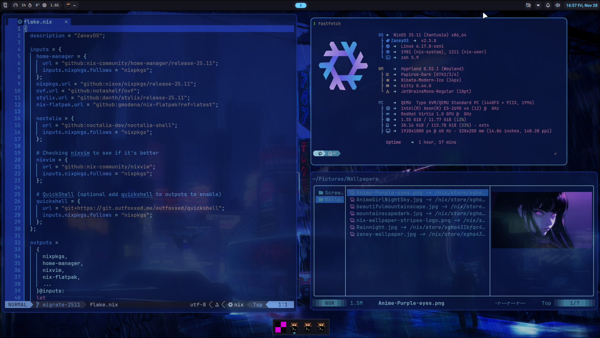
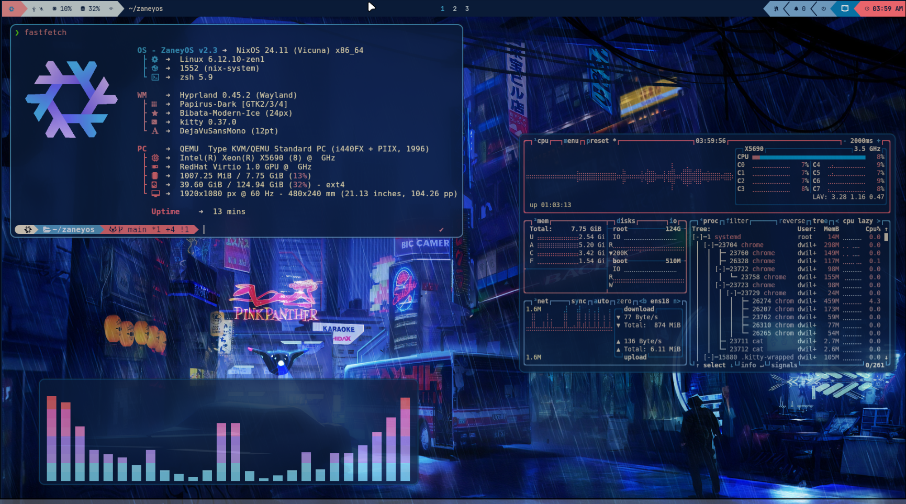
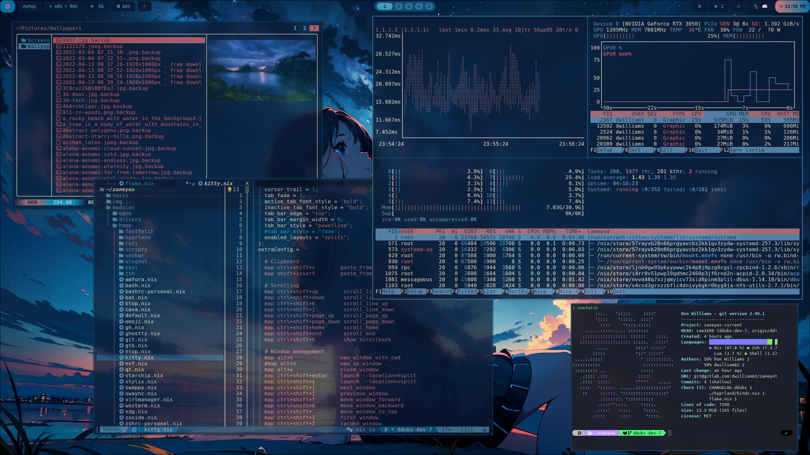
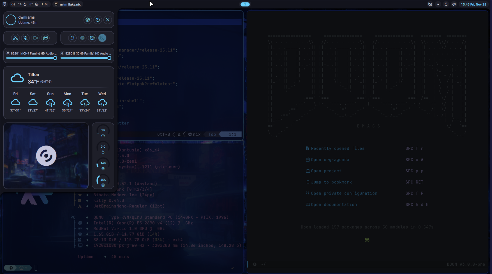
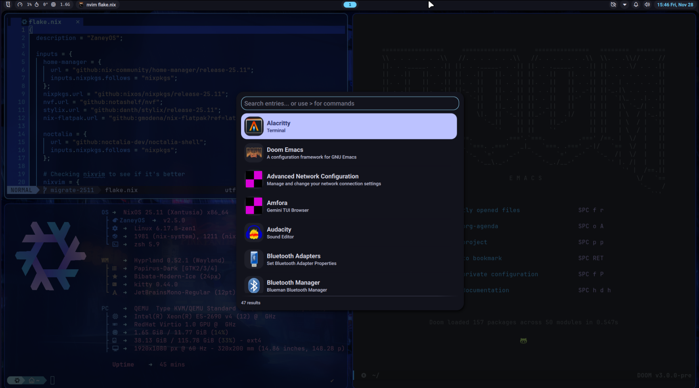
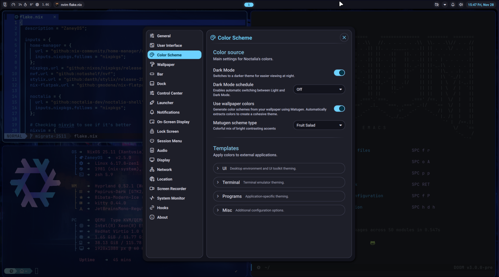
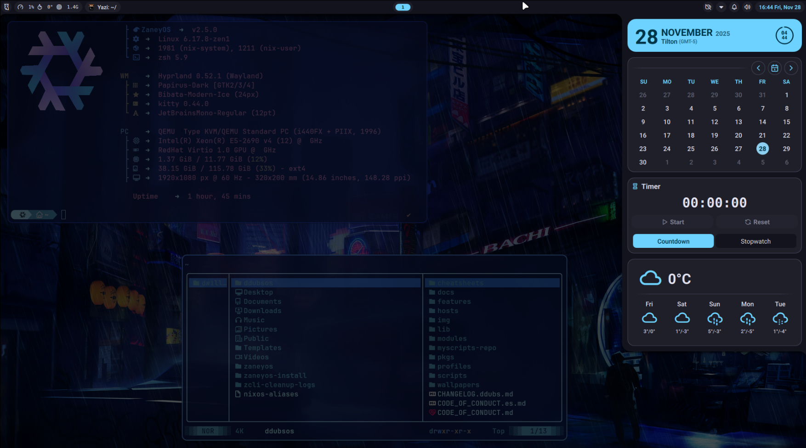
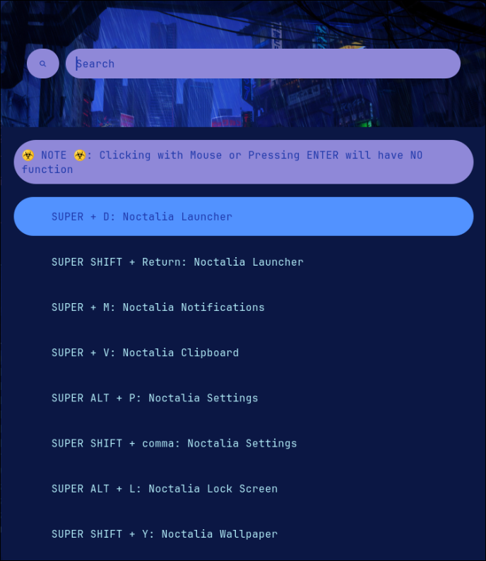
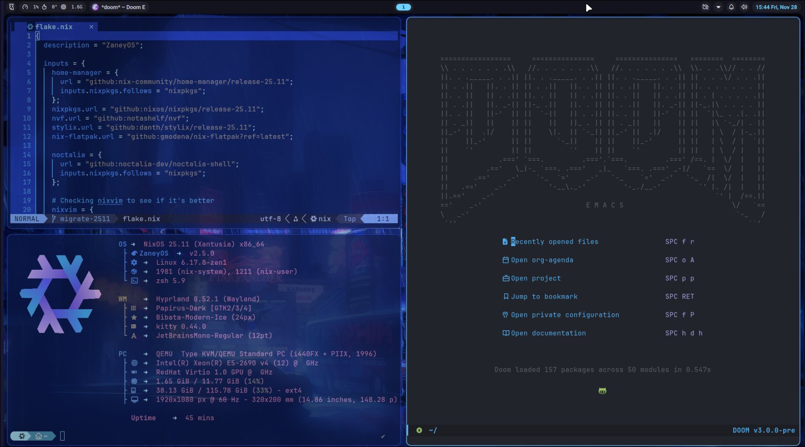
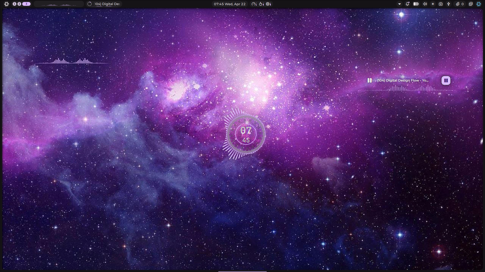

[English](README.md) | [Español](README.es.md) | [हिन्दी](README.hi.md) | [ಕನ್ನಡ](README.kn.md) | [தமிழ்](README.ta.md) | [తెలుగు](README.te.md) | [संस्कृतम्](README.sa.md) | [Deutsch](README.de.md) | [日本語](README.ja.md) | [Русский](README.ru.md) | [বাংলা](README.bn.md) | [Français](README.fr.md) | [Português](README.pt.md)

**குறிப்பு: இந்த மொழிபெயர்ப்பில் ஏதேனும் மொழியியல் பிழைகள் இருந்தால் தயவுசெய்து மன்னிக்கவும்; ஆவணங்கள் மற்றும் திட்டத்தை நீங்கள் சிறப்பாகப் புரிந்துகொள்ளும் வகையில் இதை உங்கள் மொழியில் வழங்கியுள்ளேன். தொழில்நுட்ப துல்லியத்திற்கு, ஆங்கிலம் அல்லது ஸ்பானிஷ் பதிப்புகளைப் பார்க்கவும்.**

<div align="center">

## MayankOS 🟰 சிறந்த ❄️ NixOS கட்டமைப்புகள்

\*\* புதுப்பிக்கப்பட்டது: ஏப்ரல் 22, 2026

MayankOS என்பது எனது NixOS கட்டமைப்பை எந்தவொரு கணினியிலும் மீண்டும் உருவாக்குவதற்கான ஒரு சக்திவாய்ந்த மற்றும் நேர்த்தியான வழியாகும். **ZaneyOS** திட்டத்தின் நெகிழ்வுத்தன்மை மற்றும் உத்வேகத்துடன் கட்டமைக்கப்பட்ட இது, வால்பேப்பர்கள், ஸ்கிரிப்டுகள், பயன்பாடுகள் மற்றும் உகந்த வன்பொருள் ஆதரவு உள்ளிட்ட மிகவும் தனிப்பயனாக்கப்பட்ட சூழலை வழங்குகிறது.

## 🚀 புதிய அம்சங்கள் மற்றும் வன்பொருள் ஆதரவு (v2.6.1)

இந்த பதிப்பு நவீன வன்பொருளுக்கான குறிப்பிடத்தக்க மேம்படுத்தல்கள் மற்றும் ஆதரவைக் கொண்டுவருகிறது:

### 💻 MSI Modern 14 C7M & AMD 7000 தொடர்
- **உகந்த AMD 7530U செயல்திறன்**: சக்தி மற்றும் பேட்டரி ஆயுள் ஆகியவற்றுக்கு இடையேயான சரியான சமநிலைக்கு `amd-pstate-epp` மற்றும் `auto-cpufreq` ஆகியவற்றைப் முழுமையாகப் பயன்படுத்துகிறது.
- **பேட்டரி ஆரோக்கிய மேலாண்மை**: `msi-ec` வழியாக **MSI பேட்டரி வரம்புகளுக்கு** (Battery Thresholds) நேட்டிவ் ஆதரவு, செருகப்பட்டிருக்கும் போது சார்ஜிங்கை 80% ஆகக் கட்டுப்படுத்துவதன் மூலம் உங்கள் பேட்டரியைப் பாதுகாக்கிறது.
- **மேம்பட்ட ஆற்றல் அளவிடுதல்**: ஆற்றல் நிலையின் அடிப்படையில் `performance` மற்றும் `powersave` முறைகளுக்கு இடையே தானாகவே மாறுகிறது.
- **அடுத்த தலைமுறை கிராபிக்ஸ்**: VA-API வன்பொருள் முடுக்கம், ROCm மற்றும் Vulkan கருவிகளுடன் முழு `amdgpu` ஆதரவு முன்பே கட்டமைக்கப்பட்டுள்ளது.

### 🎨 மாறுபட்ட ஷெல் அனுபவங்கள்
`variables.nix`-ல் `barChoice`-ஐ அமைப்பதன் மூலம் உங்களுக்கு விருப்பமான டெஸ்க்டாப் அனுபவத்தைத் தேர்ந்தெடுக்கவும்:
- **Noctalia**: ஒருங்கிணைந்த கணினி கட்டுப்பாடுகளுடன் கூடிய நவீன, அம்சம் நிறைந்த ஷெல்.
- **Caelestia**: ஒரு நேர்த்தியான மற்றும் இலகுரக மாற்று.
- **DMS (DankMaterialShell)**: மென்மையான, நவீன தோற்றத்திற்காக மெட்டீரியல்-டிசைன் ஈர்க்கப்பட்ட ஷெல்.
- **Waybar**: உன்னதமான, மிகவும் தனிப்பயனாக்கக்கூடிய நிலைப்பட்டி (status bar).

### 🔧 கணினி மேம்பாடுகள்
- **சமீபத்திய லினக்ஸ் கர்னல்**: சிறந்த வன்பொருள் பொருந்தக்கூடிய தன்மைக்காக இப்போது **7.x கர்னல்** வரிசையில் இயங்குகிறது.
- **மேம்படுத்தப்பட்ட Niri ஆதரவு**: Niri ஸ்க்ரோலபிள்-டைலிங் கம்போஸிட்டருக்கான முழு ஒருங்கிணைப்பு.
- **மேம்படுத்தப்பட்ட மெய்நிகராக்கம்**: VMware மற்றும் பிற மெய்நிகராக்க தளங்களுக்கான உகந்த ஆதரவு।

## 🤝 ZaneyOS உடனான உறவு

MayankOS புகழ்பெற்ற [ZaneyOS](https://gitlab.com/Zaney/zaneyos.git) திட்டத்தின் பெருமைமிக்க வாரிசு ஆகும். NixOS ஐ அணுகக்கூடியதாகவும் அழகாகவும் மாற்றும் அதே உணர்வைப் பகிர்ந்து கொண்டாலும், MayankOS அதன் சொந்த கவனத்துடன் ஒரு தனித்துவமான விநியோகமாக உருவெடுத்துள்ளது:

### 🌟 MayankOS ஐ வேறுபடுத்துவது எது?
- **நவீன வன்பொருள் கவனம்**: ZaneyOS இன் பொதுவான அணுகுமுறையைப் போலல்லாமல், MayankOS சமீபத்திய **AMD Ryzen 7000 தொடர்** மற்றும் **MSI மடிக்கணினிகளுக்கான** (பேட்டரி ஆரோக்கிய மேलाண்மை உட்பட) ஆழமான மேம்படுத்தல்களை உள்ளடக்கியது.
- **விரிவுபடுத்தப்பட்ட ஷெல் சுற்றுச்சூழல் அமைப்பு**: நாங்கள் Waybar ஐத் தாண்டி **Noctalia**, **Caelestia** மற்றும் **DMS** ஆகியவற்றிற்கான முழு ஆதரவைச் சேர்த்துள்ளோம், இது உங்கள் டெஸ்க்டாப் பணிப்பாய்வுக்கு கூடுதல் தேர்வுகளை வழங்குகிறது.
- **சமீபத்திய கர்னல் உத்தி**: சமீபத்திய வன்பொருள் அம்சங்கள் உடனடியாகச் செயல்படுவதை உறுதிசெய்ய `linuxPackages_latest` (7.x+) க்கு முன்னுரிமை அளிக்கிறோம்.
- **Niri ஒருங்கிணைப்பு**: அசல் ZaneyOS இல் காணப்படாத தனித்துவமான பணிப்பாய்வான **Niri ஸ்க்ரோலபிள்-டைலிங் கம்போஸிட்டருக்கான** முதல் தர ஆதரவைச் சேர்த்துள்ளோம்.
- **மேம்படுத்தப்பட்ட சர்வதேசமயமாக்கல்**: NixOS அனுபவத்தை உலகளாவிய பார்வையாளர்களுக்குக் கொண்டு வர 13+ மொழிகளுக்கான ஆதரவு.

நீங்கள் அசல் உத்வேகத்தைத் தேடுகிறீர்களானால், [அதிகாரப்பூர்வ ZaneyOS GitLab](https://gitlab.com/Zaney/zaneyos.git) ஐப் பார்வையிடவும். MayankOS அந்த அற்புதமான அடித்தளத்தை எடுத்து, அதிநவீன வன்பொருள் ஆதரவு மற்றும் பலதரப்பட்ட டெஸ்க்டாப் ஷெல்கள் தேவைப்படும் பயனர்களுக்காக அதை மேலும் தள்ளுகிறது.

## 🛠️ தனிப்பயன் வன்பொருள் & ஹோஸ்ட் அமைவு வழிகாட்டி

1. **புதிய ஹோஸ்டை உருவாக்குதல்**:
   - `hosts/default` கோப்புறையை உங்கள் கணினியின் பெயரிடப்பட்ட புதிய கோப்புறைக்கு நகலெடுக்கவும் (எ.கா., `cp -r hosts/default hosts/my-laptop`).
2. **உங்கள் வன்பொருள் கட்டமைப்பை உருவாக்குதல்**:
   - உங்கள் குறிப்பிட்ட வன்பொருளை (டிரைவ்கள், சிபியு போன்றவை) தானாகவே கண்டறிய `nixos-generate-config --show-hardware-config > hosts/your-hostname/hardware.nix` ஐ இயக்கவும்.
3. **உங்கள் சுயவிவரத்தைத் தேர்ந்தெடுப்பது**:
   - `flake.nix` ஐத் திறந்து, உங்கள் வன்பொருளுடன் பொருந்தக்கூடிய `profile` மாறியை அமைக்கவும் (விருப்பங்கள்: `amd`, `intel`, `nvidia`, `nvidia-laptop`, `amd-nvidia-hybrid`, அல்லது `vm`).
4. **மாறிகளை உள்ளமைத்தல்**:
   - உங்கள் திரை தெளிவுத்திறன், விருப்பமான ஷெல் (`barChoice`) மற்றும் பிற தனிப்பட்ட அமைப்புகளை அமைக்க `hosts/your-hostname/variables.nix` ஐத் திருத்தவும்.
5. **பிற மடிக்கணினிகளுக்கான ஆதரவு**:
   - உங்களிடம் MSI போன்ற பிரத்யேக மடிக்கணினி இருந்தால், `msi-ec` போன்ற கர்னல் தொகுதிகளை எவ்வாறு சேர்ப்பது என்பதற்கான உதாரணங்களுக்கு `hosts/msi-modern14c7m/default.nix` ஐப் பார்க்கலாம்.
6. **இறுதி மறுகட்டமைப்பு**:
   - அனைத்தையும் பயன்படுத்த `sudo nixos-rebuild switch --flake .#your-profile` ஐ இயக்கவும்.

## Noctalia பற்றிய முக்கியமான குறிப்பு

> நீங்கள் முதல்முறை உள்நுழையும்போது (login), திரை காலியாக இருக்கும், வெளியேற SUPER + SHIFT + C அழுத்தவும்.
> உள்நுழையவும், அதன் பிறகு Noctalia தொடங்கும்.



</div>

<details>
<summary><strong>📸 மேலும் ஸ்கிரீன்ஷாட்கள்</strong></summary>

### Waybar தீம்கள்





### Noctalia ஷெல் ஒருங்கிணைப்பு









### கூடுதல் அம்சங்கள்





### வன்பொருள் ஆதரவு (MSI Modern 14 C7M)



</details>

<div align="center">

### சீட்ஷீட்கள் மற்றும் வழிகாட்டிகள்

- Nix தொடக்க வழிகாட்டி: [English](cheatsheets/nix-beginner-guide.md) |
  [Español](cheatsheets/nix-beginner-guide.es.md)
- Hyprland தனிப்பயனாக்க வழிகாட்டி:
  [English](cheatsheets/hyprland-customization-guide.md) |
  [Español](cheatsheets/hyprland-customization-guide.es.md)

#### 🍖 தேவைகள்

- நீங்கள் NixOS, பதிப்பு 24.05+ இல் இருக்க வேண்டும்.
- `mayankos` கோப்புறை (இந்த ரெப்போ) உங்கள் ஹோம் டைரக்டரியில் இருக்க வேண்டும்.
- நீங்கள் **UEFI** மூலம் பூட் செய்து **GPT** பகிர்வைப் பயன்படுத்தி NixOS ஐ நிறுவியிருக்க வேண்டும்.
- ** குறைந்தபட்சம் 500MB /boot பகிர்வு தேவை. **
- Systemd-boot ஆதரவு உள்ளது.
- GRUB-க்கு நீங்கள் இணையத்தில் தேடி அறிய வேண்டும். ☺️
- உங்கள் ஹோஸ்ட் சார்ந்த கோப்புகளை கைமுறையாகத் திருத்துதல்.
- ஹோஸ்ட் என்பது நீங்கள் நிறுவும் குறிப்பிட்ட கணினியாகும்.

#### 🎹 பைப்வைர் மற்றும் அறிவிப்பு மெனு கட்டுப்பாடுகள்

- லினக்ஸிற்கான சமீபத்திய மற்றும் சிறந்த ஆடியோ தீர்வை நாங்கள் பயன்படுத்துகிறோம். மேல் பட்டியில் கிடைக்கும் அறிவிப்பு மையத்தில் மீடியா மற்றும் வால்யூம் கட்டுப்பாடுகள் இருக்கும்.

#### 🏇 உகந்த பணிப்பாய்வு மற்றும் மேம்பட்ட சாளர மேலாண்மை

- **Hyprland ஆதரவு**: அதிக நேர்த்தி மற்றும் செயல்திறனுக்காக இயல்புநிலை டைலிங் சாளர மேலாளர்.
- **Niri ஆதரவு**: இப்போது Niri-க்கான முழு ஆதரவும் உள்ளது, இது ஒரு ஸ்க்ரோலபிள்-டைலிங் வேலேண்ட் கம்போஸிட்டர். உங்கள் `variables.nix`-ல் `niriEnable` மூலம் இதை மாற்றவும்.
- **KDE Plasma (விருப்பத்தேர்வு)**: KDE Plasma 6-க்கான ஆதரவு உள்ளது, ஆனால் இயல்பாக முடக்கப்பட்டுள்ளது.
- இங்கே பெரிய NeoVIM திட்டம் இல்லை, சிறந்த NeoVIM அமைப்பிற்காக `nixvim`-ஐப் பயன்படுத்துகிறோம். மொழி ஆதரவு ஏற்கனவே சேர்க்கப்பட்டுள்ளது.

#### 🖥️ மல்டி ஹோஸ்ட் மற்றும் பயனர் கட்டமைப்பு

- வெவ்வேறு ஹோஸ்ட் இயந்திரங்கள் மற்றும் பயனர்களுக்கு தனித்தனி அமைப்புகளை நீங்கள் வரையறுக்கலாம்.
- `modules/core/user.nix` கோப்பில் உங்கள் பயனர்களுக்கான கூடுதல் தொகுப்புகளை எளிதாகக் குறிப்பிடலாம்.
- புரிந்துகொள்ள எளிதான கோப்பு அமைப்பு மற்றும் எளிமையான, ஆனால் முழுமையான கட்டமைப்பு.

#### 👼 ஆதரவில் கவனம் செலுத்தும் ஒரு அற்புதமான சமூகம்

- NixOS-ஐ அணுகக்கூடிய இடமாக மாற்றுவதே MayankOS-ன் முழு யோசனையாகும்.
- NixOS என்பது நீங்கள் ஒரு அங்கமாக இருக்க விரும்பும் ஒரு சிறந்த சமூகம்.
- பொறுமையாக இருப்பவர்கள் மற்றும் உங்களுக்கு உதவத் தங்கள் ஓய்வு நேரத்தைச் செலவழிப்பதில் மகிழ்ச்சியடைபவர்கள் பலர் MayankOS-ஐ இயக்குகிறார்கள்.
- எந்த உதவிக்கும் டிஸ்கார்டில் எங்களைத் தொடர்பு கொள்ளவும்.

#### 📦 பேக்கேஜ்களை எவ்வாறு நிறுவுவது?

- ஒரு பேக்கேஜின் பெயர் என்ன அல்லது நீங்கள் எதிர்கொள்ளும் கட்டமைப்புத் தடைகளைத் தீர்க்கும் விருப்பங்கள் உள்ளனவா என்பதை அறிய [Nix Packages](https://search.nixos.org/packages?) & [Options](https://search.nixos.org/options?) பக்கங்களில் தேடலாம்.
- ஒரு பேக்கேஜைச் சேர்க்க `modules/core/packages.nix` மற்றும் `modules/core/user.nix`-ல் அதற்கான பிரிவுகள் உள்ளன. ஒன்று கணினி முழுவதும் கிடைக்கும் நிரல்களுக்கும் மற்றொன்று உங்கள் பயனர் சூழலுக்கும் மட்டுமே.

#### 🐧 டெஸ்க்டாப் சூழல்களை மாற்றுதல்

MayankOS பல சூழல்களை ஆதரிக்கிறது:
- **Hyprland**: இயல்பாகவே இயக்கப்பட்டது.
- **Niri**: உங்கள் ஹோஸ்டின் `variables.nix`-ல் `niriEnable = true;` என அமைப்பதன் மூலம் இதை இயக்கவும்.
- **KDE Plasma**: KDE Plasma-வை இயக்க, `modules/core/xserver.nix`-க்குச் சென்று `services.desktopManager.plasma6.enable = true;` வரி மற்றும் அதனுடன் தொடர்புடைய `environment.systemPackages` தொகுப்பை அன்கமெண்ட் (uncomment) செய்யவும்.

#### 🙋 சிக்கல்கள் / கேள்விகள் உள்ளதா?

- ரெப்போவில் சிக்கலை எழுப்ப தயங்காதீர்கள், தயவுசெய்து [feature request] என்று தொடங்கும் தலைப்புடன் அம்சக் கோரிக்கையை லேபிளிடவும், நன்றி!
- விரைவான பதிலுக்கு எங்களை [Discord](https://discord.gg/XhZmNTnhtp)-லும் தொடர்பு கொள்ளவும்.

# Hyprland கீபைண்டிங்குகள் (Keybindings)

Hyprland-க்கான கீபைண்டிங்குகள் கீழே எளிதான குறிப்புக்காக வடிவமைக்கப்பட்டுள்ளன. வலது நெடுவரிசை **Noctalia ஷெல்**-க்கு குறிப்பிட்ட கீபைண்டிங்குகளைக் காட்டுகிறது (`barChoice = "noctalia"` இருக்கும்போது மட்டுமே கிடைக்கும்).

<table>
<tr>
<td width="50%">

## நிலையான கீபைண்டிங்குகள்

### பயன்பாட்டைத் தொடங்குதல்

- `$modifier + Return` → `terminal`-ஐத் தொடங்கு
- `$modifier + Tab` → `Quickshell Overview`-ஐ மாற்று (நேரலை மாதிரிக்காட்சிகளுடன் கூடிய பணியிட மேலோட்டம்)
- `$modifier + K` → கீபைண்டுகளைப் பட்டியலிடு
- `$modifier + Shift + W` → `web-search`-ஐத் திற
- `$modifier + Alt + W` → `wallsetter`-ஐத் திற
- `$modifier + Shift + N` → `swaync-client -rs`-ஐ இயக்கு
- `$modifier + W` → `Web Browser`-ஐத் தொடங்கு
- `$modifier + Y` → `yazi`-யுடன் `kitty`-யைத் திற
- `$modifier + E` → `emopicker9000`-ஐத் திற
- `$modifier + S` → ஸ்கிரீன்ஷாட் எடு
- `$modifier + Shift + D` → `Discord`-ஐத் திற
- `$modifier + O` → `OBS Studio`-வைத் தொடங்கு
- `$modifier + Alt + C` → கலர் பிக்கர்
- `$modifier + G` → `GIMP`-ஐத் திற
- `$modifier + T` → `pypr` மூலம் டெர்மினலை மாற்று
- `$modifier + Alt + M` → `pavucontrol`-ஐத் திற

### சாளர மேலாண்மை (Window Management)

- `$modifier + Q` → செயலில் உள்ள சாளரத்தை மூடு
- `$modifier + P` → சூடோ டைலிங்கை (pseudo tiling) மாற்று
- `$modifier + Shift + I` → ஸ்பிளிட் பயன்முறையை (split mode) மாற்று
- `$modifier + F` → முழுத்திரையை மாற்று
- `$modifier + Shift + F` → மிதக்கும் பயன்முறையை (floating mode) மாற்று
- `$modifier + Alt + F` → அனைத்து சாளரங்களையும் மிதக்க விடு
- `$modifier + Shift + C` → Hyprland-லிருந்து வெளியேறு

### சாளர இயக்கம்

- `$modifier + Shift + ← / → / ↑ / ↓` → இடது/வலது/மேல்/கீழ் நகர்த்து
- `$modifier + Shift + H / L / K / J` → இடது/வலது/மேல்/கீழ் நகர்த்து
- `$modifier + Alt + ← / → / ↑ / ↓` → இடது/வலது/மேல்/கீழ் மாற்றிக்கொள்

### கவனம் நகர்த்துதல் (Focus Movement)

- `$modifier + ← / → / ↑ / ↓` → கவனத்தை இடது/வலது/மேல்/கீழ் நகர்த்து
- `$modifier + H / L / K / J` → கவனத்தை இடது/வலது/மேல்/கீழ் நகர்த்து

### பணியிடங்கள் (Workspaces)

- `$modifier + 1-10` → பணியிடம் 1-10-க்கு மாறு
- `$modifier + Shift + Space` → சாளரத்தை சிறப்புப் பணியிடத்திற்கு நகர்த்து
- `$modifier + Space` → சிறப்புப் பணியிடத்தை மாற்று
- `$modifier + Shift + 1-10` → சாளரத்தை பணியிடம் 1-10-க்கு நகர்த்து
- `$modifier + Control + → / ←` → பணியிடத்தை முன்னோக்கி/பின்னோக்கி மாற்று

### சாளரச் சுழற்சி

- `Alt + Tab` → அடுத்த சாளரத்திற்குச் செல் / செயலில் உள்ளதை மேலே கொண்டு வா

</td>
<td width="50%">

## 🎨 Noctalia ஷெல் கீபைண்டிங்குகள்

_`variables.nix`-ல் `barChoice = "noctalia"` இருக்கும்போது கிடைக்கும்_

- `$modifier + D` → லாஞ்சரை மாற்று
- `$modifier + Shift + Return` → லாஞ்சரை மாற்று
- `$modifier + M` → அறிவிப்புகள் மெனு
- `$modifier + V` → கிளிப்போர்டு மேலாளர்
- `$modifier + Alt + P` → அமைப்புகள் பேனல்
- `$modifier + Shift + ,` → அமைப்புகள் பேனல்
- `$modifier + Alt + L` → லாக் ஸ்கிரீன்
- `$modifier + Shift + Y` → வால்பேப்பர் மேலாளர்
- `$modifier + X` → பவர் மெனு
- `$modifier + C` → கட்டுப்பாட்டு மையம்
- `$modifier + Ctrl + R` → ஸ்கிரீன் ரெக்கார்டர்

### Rofi லாஞ்சர் (Waybar பயன்முறை)

_`variables.nix`-ல் `barChoice = "waybar"` இருக்கும்போது கிடைக்கும்_

- `$modifier + D` → Rofi லாஞ்சரைத் தொடங்கு
- `$modifier + Shift + Return` → Rofi லாஞ்சரைத் தொடங்கு

### இதர அம்சங்கள்

- `$modifier + Shift + Return` (Waybar) → பயன்பாட்டு லாஞ்சர்
- `$modifier + V` (Waybar) → `cliphist` மூலம் கிளிப்போர்டு வரலாறு

</td>
</tr>
</table>

## நிறுவல்:

> **⚠️ முக்கியம்:** இந்த நிறுவல் முறைகள் **புதிய நிறுவல்களுக்கு மட்டுமே**. நீங்கள் ஏற்கனவே MayankOS ஐ நிறுவியிருந்தால் மற்றும் v2.4-க்கு மேம்படுத்த விரும்பினால், கீழே உள்ள [மேம்படுத்தல் வழிமுறைகளைப்](#upgrading-from-mayankos-23-to-24) பார்க்கவும். குறிப்பு: மேம்படுத்தல் ஸ்கிரிப்ட்டில் சிக்கல் உள்ளது. அது சரிசெய்யப்படும் வரை அகற்றப்பட்டுள்ளது.

<details>
<summary><strong> ⬇️ ஸ்கிரிப்ட் மூலம் நிறுவுதல் (புதிய நிறுவல்களுக்கு மட்டுமே)</strong></summary>

### 📜 ஸ்கிரிப்ட்:

இது **புதிய நிறுவல்களுக்கு** தொடங்குவதற்கான எளிதான மற்றும் பரிந்துரைக்கப்பட்ட வழியாகும். பிளேக் (flake)-ல் உள்ள ஒவ்வொரு விருப்பத்தையும் மாற்ற அல்லது கூடுதல் தொகுப்புகளை நிறுவ இந்த ஸ்கிரிப்ட் உதவாது. இது எனது கட்டமைப்பை குறைந்தபட்ச சிக்கல்களுடன் நிறுவவும், பின்னர் உங்கள் விருப்பப்படி மாற்றிக்கொள்ளவும் மட்டுமே உள்ளது!

> **⚠️ எச்சரிக்கை:** இந்த ஸ்கிரிப்ட் ஏற்கனவே உள்ள ~/mayankos கோப்பகத்தை முழுமையாக மாற்றும். நீங்கள் ஏற்கனவே MayankOS-ஐ நிறுவி கட்டமைத்திருந்தால் இதைப் பயன்படுத்த வேண்டாம்.

இதை நகலெடுத்து இயக்கவும்:

```bash
nix-shell -p git curl pciutils
```

பிறகு:

```bash
sh <(curl -L https://raw.githubusercontent.com/techanand8/mayankos/main/install-mayankos.sh)
```

#### நிறுவல் முடிந்ததும் உங்கள் சூழல் சிதைந்து காணப்படலாம். கணினியை மறுதொடக்கம் (reboot) செய்யவும், அப்போது உள்நுழைவுத் திரையைக் காண்பீர்கள்.

</details>

<details>
<summary><strong> 🦽 கைமுறை நிறுவல் செயல்முறை:  </strong></summary>

1. Git & Vim நிறுவப்பட்டுள்ளதை உறுதி செய்ய இந்த கட்டளையை இயக்கவும்:

```bash
nix-shell -p git vim
```

2. இந்த ரெப்போவை குளோன் செய்து உள்ளே நுழையவும்:

```bash
cd && git clone https://github.com/techanand8/mayankos.git ~/mayankos
cd ~/mayankos
```

3. உங்கள் கணினிக்கான ஹோஸ்ட் கோப்புறையை இவ்வாறு உருவாக்கவும்:

```bash
cp -r hosts/default hosts/<your-desired-hostname>
```

4. உங்கள் வன்பொருள் கட்டமைப்பை உருவாக்கவும்:

```bash
nixos-generate-config --show-hardware-config > hosts/<your-desired-hostname>/hardware.nix
```

5. உங்கள் ஹோஸ்ட் பெயர் மற்றும் சுயவிவரத்துடன் பொருந்தும்படி `hosts/<your-desired-hostname>/variables.nix` மற்றும் `flake.nix`-ஐத் திருத்தவும்.

6. பிளேக்கை நிறுவவும் (`profile`-ஐ `intel`, `nvidia`, `nvidia-laptop`, `amd`, `amd-nvidia-hybrid`, அல்லது `vm` மூலம் மாற்றவும்):

```bash
sudo nixos-rebuild switch --flake .#profile
```

இப்போது நீங்கள் கட்டமைப்பை மீண்டும் உருவாக்க விரும்பும்போது `mcli rebuild` கட்டளையை அல்லது `fr` என்ற மாற்றுப் பெயரைப் பயன்படுத்தலாம்.

</details>

### சிறப்பு அங்கீகாரங்கள்:

உங்கள் அனைத்து உதவிகளுக்கும் நன்றி

- KoolDots https://github.com/LinuxBeginnings
- JakKoolit https://github.com/Jakoolit
- Justaguylinux https://codeberg.org/Justaguylinux
- Jerry Starke https://github.com/JerrySM64

## நீங்கள் மகிழ்வீர்கள் என்று நம்புகிறேன்!
